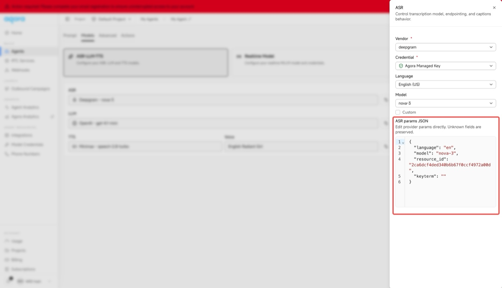

# Scenes backend

Shared by all three clients (Web / Android / iOS). Runs on your own machine with
your own credentials.

There are two ways to bring the avatar in. The scenes behave identically
either way — pick one:

| | `TRANSPORT=livekit` | `TRANSPORT=agora` |
|---|---|---|
| Who runs the conversation | your machine (`server.py` starts the worker for you) | Agora Conversational AI Engine (hosted) |
| Where models and voice are configured | local `.env` | the agent in the Agora console |

Both need five credentials and both start with a single `python server.py`.

Either way the avatar's motion data is generated by Spatius and published into
the same channel, and the client renders it locally — what travels over the wire
is audio plus motion data, not rendered video.

## Setup

```bash
cd backend
python -m venv .venv && source .venv/bin/activate
pip install -r requirements.txt
cp .env.example .env      # fill in your credentials
```

You can also leave it empty and fill everything in from a client's config page —
it writes back to `.env`. The transport can be switched there too.

### LiveKit

| Setting | Where to get it |
|---|---|
| `SPATIUS_API_KEY` / `SPATIUS_APP_ID` | https://app.spatius.ai/apps |
| `LIVEKIT_URL` / `LIVEKIT_API_KEY` / `LIVEKIT_API_SECRET` | https://cloud.livekit.io (the secret is shown only once) |

Models go through LiveKit Inference, so you do not need OpenAI, Deepgram or any
other account of your own. To change the model or voice, edit `STT_MODEL`,
`LLM_MODEL` and `TTS_MODEL` in `.env`.

### Agora

| Setting | Where to get it |
|---|---|
| `SPATIUS_API_KEY` / `SPATIUS_APP_ID` | https://app.spatius.ai/apps |
| `AGORA_APP_ID` / `AGORA_APP_CERTIFICATE` | https://console.agora.io → Projects |
| `AGORA_PIPELINE_ID` | the same console → Agents |

The **primary certificate** has to be enabled for the project under Projects
before it has a value. The backend signs tokens with it on the fly, which is why
you do not need the Customer ID / Secret pair.

To get the **pipeline id**: create an agent under Agents, set its prompt, LLM
and TTS, hit **Publish**, then copy it from the **Code** panel on the right.
The models, the voice and the persona all live in that agent — the backend only
references it, so you do not need to sign up with each model provider.

If starting a session fails with **`properties: tts.addon not found`**, the
pipeline id does not resolve under this App ID: a made-up id, an id copied from
an agent in a different project, and an agent that was never published all fail
with exactly that message. Check that the agent lives in the project whose App
ID you entered, that it has been published, and that the id is the pipeline id
from the Code panel (not the agent's name or URL).

Leave the agent's **ASR** at what a new agent comes with (Deepgram `nova-3`).
The backend sends that exact setup with every session, so a fresh agent works
as is — checked against a second Agora account with a newly created agent. If
you do change the ASR, see the second warning below.

⚠️ **The sample rates have to match.** `AGORA_AVATAR_SAMPLE_RATE` (24000 by
default) must equal the TTS output sample rate of that agent, which you can see
in the console under Models → TTS → Sample rate. The avatar does not resample,
and a mismatch is silent on both sides: the avatar joins, renders and publishes
as usual, its audio track reports `playing`, and the volume stays at zero — the
picture is fine and nothing is ever said. This is the hardest failure to
diagnose here. Some providers (OpenAI, for one) do not expose the setting at
all; they emit 24000, so leaving the default alone is correct. MiniMax defaults
to 32000, so either change it to 24000 there or change this to 32000.

Supported rates: `8000` / `16000` / `22050` / `24000` / `32000` / `44100` /
`48000`.

⚠️ **Speech recognition is configured in two places and both have to agree.**
The backend sends an `asr` block naming a vendor and model, with the language
chosen to match the UI so that switching to English makes the avatar understand
English. The vendor and model are constants at the top of `agora.py`:

```python
ASR_VENDOR = "deepgram"
ASR_MODEL = "nova-3"
```

They are the defaults a newly created agent comes with, so if you never touched
the ASR panel there is nothing to do here. Only when you have switched the
vendor or the model in the console do they need changing: open the agent under
Agents → Models, click the settings icon beside ASR, and the panel shows the
vendor in the dropdown and the model in its **ASR params JSON**:



The `resource_id` in that JSON is not needed: the join API ignores it (a
made-up id recognised Chinese and English just the same), and the credential
comes from the agent itself.

A mismatch here is as quiet as the sample rate one: Chinese speech comes back
transcribed as `"Yeah."` and `"Hello?"`, or as empty text with the timings
intact, and the avatar either answers something unrelated or never replies.
Nothing reports an error on either side.

## Running

```bash
python server.py
```

Listens on `0.0.0.0:8787` and prints the LAN address to use from a phone.

The LiveKit path runs the conversation locally through an agent worker, and
`server.py` starts that worker itself (the Agora path does not need one, so it
is skipped). Without the worker the symptom is "the scene opens but the avatar
never says anything", with no error on either side — not something to leave to
the reader to remember.

`GET /health` reports which transport is currently active.

## Connecting a client

The backend binds `0.0.0.0`, so a phone on the same network can reach it
directly.

- **Web**: open `http://localhost:5180/spatius-scenario-demo/`.
- **Android / iOS**: a device cannot reach your computer's `localhost`, so enter
  the LAN address on the app's config page. The backend prints it on startup, and
  `GET /health` returns it as `lanUrl`.

## API

The shape is the same for both transports, so clients do not need to
special-case them.

```
POST /api/session            { lang, transport? }    → connection credentials
POST /api/session/say        { sessionId, text }
POST /api/session/interrupt  { sessionId }
POST /api/session/free-talk  { sessionId, lang, persona?, custom?, memoryKey? }
POST /api/session/stop       { sessionId, remember?, persona? }
GET  /health                                          → { ok, lanUrl, transport }
GET  /api/config                                      → current config + the fields each transport needs
POST /api/config             { KEY: value, ... }      → writes back to .env
GET  /api/memory?persona=    → { summary, turns, size }
POST /api/memory/clear       { persona }
```

`transport` on `/api/session` lets a client ask for one regardless of what `TRANSPORT` is
set to. The mobile clients ship the Agora SDK alone and always send `"agora"` — served the
LiveKit response they would get a room name and a URL they cannot use. The web client
speaks both and leaves it out, so it follows the setting.

`persona`, `custom` and `memoryKey` on `free-talk`, and `remember` / `persona` on `stop`,
are the companion scene's; the other three scenes leave them out and get the old
behaviour.

`/api/session` returns a `transport` field; the rest of the response varies with
it, and the client picks its provider accordingly:

```jsonc
// livekit
{ "transport": "livekit", "sessionId": "…", "url": "wss://…", "token": "…",
  "roomName": "…", "spatiusAppId": "…", "avatarId": "…" }

// agora
{ "transport": "agora", "sessionId": "…", "appId": "…", "channelName": "…",
  "token": "…", "uid": 123456, "agentUid": 654321, "spatiusAppId": "…",
  "spatiusRegion": "…", "avatarId": "…" }
```

**`/api/session` starts billing immediately.** Clients must call
`/api/session/stop` when they leave. Both transports have their own fallback
(LiveKit's empty-room timeout, ConvoAI's `idle_timeout`), but each waits about a
minute, and that minute is billed.

## What the companion remembers

The companion scene is the only one that carries anything between visits. What either
side says is written to `memory/<character>-<language>.json` and folded into that
character's persona the next time it is opened, so the second conversation starts from
where the first left off.

One file per character and language. Per character so that what you told one does not
come back out of another; per language because the transcript goes into the prompt
verbatim, and asking a model answering in Chinese to pull a detail out of an English
transcript adds a translation step that loses things.

How the transcript is collected differs by transport, because the conversation does not
happen in the same place:

- **Agora**: it happens inside ConvoAI, so it is fetched with
  `GET /agents/<id>/history` as the session ends — the transcript goes away with the
  agent. Lines the client sent through `speak` are filtered out: those are fixed text,
  not something either side said.
- **LiveKit**: the worker sees every turn, so it writes each one as it happens. A tab
  closed mid-conversation still leaves everything before it.

Past about 6000 characters the memory is summarised down to roughly 1000 by an LLM. That
needs `LLM_API_KEY` and `LLM_BASE_URL` (any OpenAI-compatible endpoint) — **neither
transport provides one**, since Agora keeps its model in the console and LiveKit goes
through Inference. Without them the summariser is simply skipped and the oldest lines are
dropped instead, which keeps the prompt bounded either way.

`memory/` is gitignored: it holds real conversations.

## Two things about timing

**The client owns the interaction.** `say`, `interrupt` and `free-talk` are all
initiated by the client; the backend executes them and never speaks on its own.
`free-talk` only switches the persona — the client says the transition line
itself. If both sides spoke, the two messages would arrive back to back at the
same agent and interrupt each other, and the client's throttling would have no
say over the server's line.

**Wait for the agent before the first line.** Both transports have this, with
different signals: LiveKit waits for the agent to announce `ready` (`agent.py`
sets that attribute after `session.start()`); Agora waits for the participant
with `agentUid` to join the channel. Send too early and the backend still
answers 200, but nobody says the line — it looks like "the scene is up but the
avatar won't say its first line". The clients handle this already; worth knowing
if you integrate your own.

## ⚠️ This is a demo

There is no authentication: anyone who can reach this address can start a
session, and sessions cost you money. Add authentication and rate limiting
before putting it on a public network, or keep it on your LAN.
